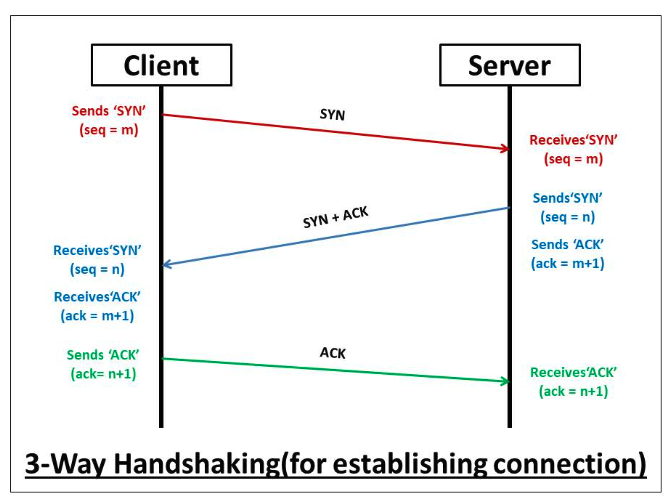
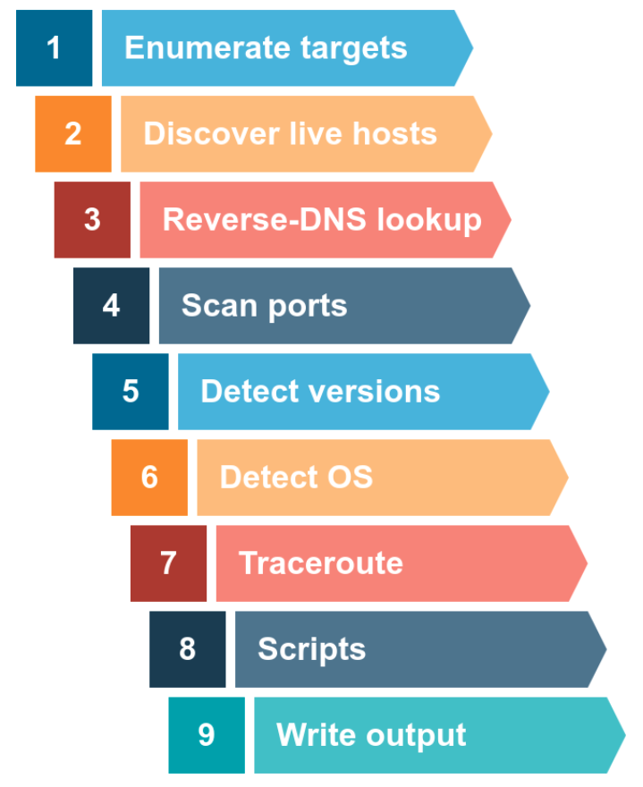

#### Nuclei
Nuclei is used for running automation  and there are lot of automated scripts available inside nuclei template

`-file` is necessary for the run

```
nuclei -l alljs_katana  -t /home/kali/.local/nuclei-templates/file/js/ -file -vv
nuclei -l alljs_katana -tags 'js-analyse' -file -vv
nuclei -l alljs_katana -id 'js-analyse' -file -vv
nuclei -l alljs_katana -t 'file/js' -t file/keys -file -vv

```
for running takeover templates:
`nuclei -t http/takeovers -stats -vv -pc 10 -jsc 60  -l live_subdomain_httpx_toolkit_subdomain_only`
Bursuite jsfinder addon installation

### Scan port and version using IP
Finding a lot of IPs
  - find bigger domain which has lot of IPs like apple.com not flipkart, can be checked on arin whois
  - ASN to CIDR lookup via cmd tool by projectdiscovery `asnmap`
    - `asnmap -a AS714`
  - cidr to IPs `mapcidr -cidr` 
    - `python ../../../tools/cidr2ip.py cidr all_ip` or
    - `mapcidr -cidr cidr` way slower than first
  - Reverse dns (PTR)
    - `dnsx -ptr -resp-only -l ips.txt`
    - ```
        echo 173.0.84.0/24 | dnsx -silent -resp-only -ptr # Get all subdomain using CIDR
        echo AS17012 | dnsx -silent -resp-only -ptr # get all subdomain using ASN
        dnsx -l subdomain_list.txt -wd airbnb.com -o output.txt # get subdomain from the given list also using wildcard
      ```
    - Read more about this
  - Port scanning
    - `nabbu`
      -  `	naabu -host <CIDR>  -p 0-1024`
      -  nabbu with nmap: `	naabu -host 142.250.194.78  -p 0-1024 -nmap-cli "nmap -Vs"
`
    - `massscan` 
      - nmap is for depth port scan of single machine while masscan is for port scanning on many devices
      - To create configuration `sudo masscan -iL allips  --banners  -p80,443,22,8080,3678 --top-ports 100  --output-format list -oL ip_masscan --rate=1000 --echo > masscan.conf`
        - At rate=1000 gives reliable result and make the ports all not more than 1000
        - `-p1-1000,8080` can also be used for ports
      - To start the scan `masscan --resume masscan.conf`
      - To resume the scan `masscan --resume paused.conf` 
  
  
    - `sudo masscan <cidr>   -p0-1000  --rate=10000`
      Have not figured out the nmap usage in this
      `sudo masscan  142.250.194.78  -p80,443 --rate=10000 -oL portscan_out`
      
    - `nmap` : port scanning for a single machine
      - `nmap <ip> -sV`
      - `sudo nmap -A -sV -sC -O -p- -T3 -iL live_ips.txt -oN port_scan.txt`

  - Service check using nmap


### Nmap port scanning

- check the Nmap cheatsheet pdf
- `-PX` is meant host discovery on specific port and 
- `-sX` is meant for port scanning 
- For local network scan, using ARP protocol where who has this IP request is broadcasted and receives a response whoever has that to map ip to MAC address. This protocol is not used elsewhere
`sudo nmap   10.0.2.1/24  -PR -sn --reason -vv `
- ICMP scan: used for error report, host discovery using ICMP. Also not feasible as being blocked by the firewalls. Mostly not being used
`sudo nmap   10.0.2.1/24  -PE -sn --reason -vv ` or `sudo nmap gogole.com/24 -sn`
  `PP` : ICMP timestamp
  `PM` : ICMP Address mask 
- Important options
  - `-Pn`: No host discovery, only port scan
  - `-n` is meant for no dns resolution
  - `T1-5` is meant for fast scan, default is `T3`
  - `-A` `-min-rate 1000` `-max-retries 3`
  - `-sV` for version detection for service running on the port
  - `-A` for all scan of OS detection, version, script scanning and traceroute
  - `-R` : reverse DNS lookup for all hosts (offline also)
  - `-v` : verbose
- Nmap firewall bypassing: https://nmap.org/book/man-bypass-firewalls-ids.html
- State of port 
  1) OPEN 
  2) CLOSE
  3) Filtered: Due to some firewall , it does not whether port is open or close
  4) Unfiltered: Port is accessible but does not know whether port is open/close
  5) Open filtered: does not know whether port is open or filtered
  6) Close filtered: does not know whether port is close or filtered

#### TCP and UDP scan
SYN scan
`sudo nmap   -sS -sn  -vv google.com/30 --reason`
ACK scan
`sudo nmap   -sA -sn  -vv google.com/30 --reason`
UDP scan
`sudo nmap   -sU -Pn -n -vv google.com/30 --reason`
TCP scan
`sudo nmap   -sT -sn  -vv google.com/30 --reason`

#### More stealthier scan
- NULL scans (`-sN`) are when the TCP request is sent with no flags set at all. As per the RFC, the target host should respond with a RST if the port is closed
- FIN scans (`-sF`) work in an almost identical fashion; however, instead of sending a completely empty packet, a request is sent with the FIN flag (usually used to gracefully close an active connection). Once again, Nmap expects a RST if the port is closed
- Xmas scans (`-sX`) send a malformed TCP packet and expects a RST response for closed ports
- NULL, FIN and Xmas scans will only ever identify ports as being `open|filtered`, `closed`, or `filtered`
- Many firewalls are configured to drop incoming TCP packets to blocked ports which have the SYN flag set (thus blocking new connection initiation requests). By sending requests which do not contain the SYN flag, we effectively bypass this kind of firewall. Whilst this is good in theory, most modern IDS solutions are savvy to these scan types, so don't rely on them to be 100% effective when dealing with modern systems
- If the ICMP is disabled then we might stop the host discovery mode and use port scanning otherwise nmap does first host discovery using ICMP and if it get blocked, then it will mark it dead and will not scan
Sol : `nmap 10.10.84.246 -s<X>  -p 1-999 -vv -Pn`

#### NSE (Nmap Scripts)
Written in lua language for automation of network tasks
Pre-written scripts are available at `/usr/share/nmap/scripts`

- Running default scripts `-sC`
`nmap  19.12.108.56 -T4 -A -min-rate 1000 -max-retries 3 -sC`
- Running all script starts with `http`
`nmap  19.12.108.56 -T4 -A -min-rate 1000 -max-retries 3 --script=http* -vv`
- can be run on the category
  `nmap  19.12.108.56 -T4 -A -min-rate 1000 -max-retries 3 --script <category> -vv`
- Passing script arguement to script name . something
`nmap -p 80 --script http-put --script-args http-put.url='/dav/shell.php',http-put.file='./shell.php'`
`nmap --script-help <script-name>`
`sudo nmap 10.10.165.250  -sT -p 21  -vv  -Pn --script=ftp-anon --reason`



* Enumerate
  Use `masscan` for this or even 
* Host Discovery
  * To check if host is live using: nmap  using various protocol like ARP, TCP, UDP, ICMP
* Port Scanning
* Service and version iteration
* OS Detection
* Exploit
    After recon do search for exploit on `searchexploit` or exploit db

